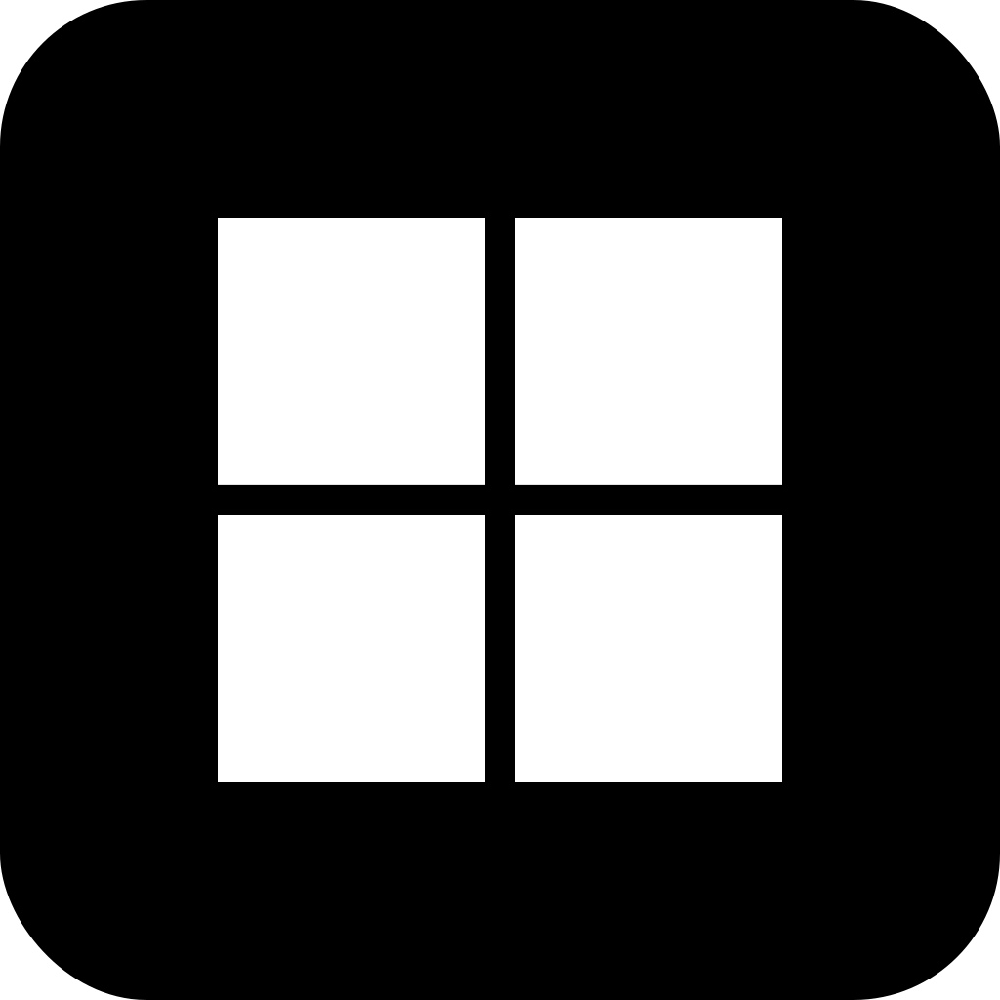
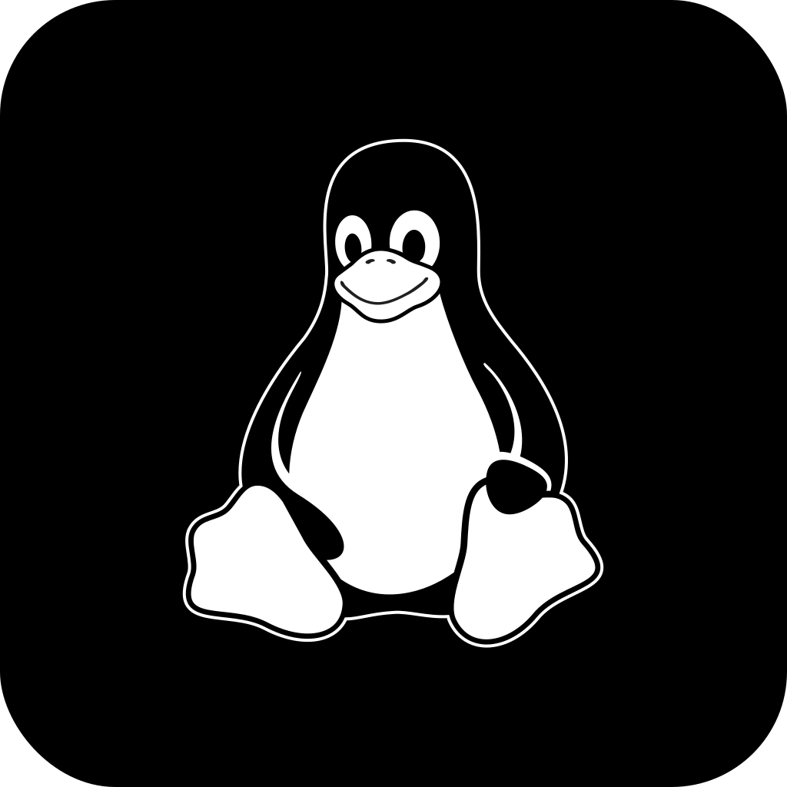

<p align="center">
  
</p>
<p align="center">
  <b>An open-source, lightweight and privacy-focused BeReal alternative client.</b>
</p>
<p align="center">
  <a href="https://github.com/Vexcited/StayReal/actions/workflows/build.yml">
    
  </a>
  <a href="./LICENSE.md">
    
  </a>
</p>

## 📥 Download

<table align="center">
  <tr>
    <th>
      
      <br><p align="center">Windows</p>
    </th>
    <th>
      
      <br><p align="center">macOS</p>
    </th>
    <th>
      
      <br><p align="center">Linux</p>
    </th>
  </tr>

  <tr>
    <td width="30%">
      <div align="center">
        <b>x86_64</b> : <a href="https://nightly.link/Vexcited/StayReal/workflows/build/main/stayreal-x86_64-pc-windows-msvc-msi.zip">&nearr;&nbsp;MSI</a>, <a href="https://nightly.link/Vexcited/StayReal/workflows/build/main/stayreal-x86_64-pc-windows-msvc-nsis.zip">&nearr;&nbsp;NSIS</a>
        <br>
        <b>aarch64</b> : <a href="https://nightly.link/Vexcited/StayReal/workflows/build/main/stayreal-aarch64-pc-windows-msvc-nsis.zip">&nearr;&nbsp;NSIS</a>
      </div>
    </td>
    <td width="30%">
      <div align="center">
        <b>aarch64</b> : <a href="https://nightly.link/Vexcited/StayReal/workflows/build/main/stayreal-aarch64-apple-darwin-dmg.zip">&nearr;&nbsp;DMG</a>
        <br>
        <b>x86_64</b> : <a href="https://nightly.link/Vexcited/StayReal/workflows/build/main/stayreal-x86_64-apple-darwin-dmg.zip">&nearr;&nbsp;DMG</a>
      </div>
    </td>
    <td width="30%">
      <div align="center">
        <b>x86_64</b> : <a href="https://nightly.link/Vexcited/StayReal/workflows/build/main/stayreal-x86_64-unknown-linux-gnu-deb.zip">&nearr;&nbsp;DEB</a>, <a href="https://nightly.link/Vexcited/StayReal/workflows/build/main/stayreal-x86_64-unknown-linux-gnu-rpm.zip">&nearr;&nbsp;RPM</a>, <a href="https://nightly.link/Vexcited/StayReal/workflows/build/main/stayreal-x86_64-unknown-linux-gnu-appimage.zip">&nearr;&nbsp;AppImage</a>
        <br>
        <b>aarch64</b> : <a href="https://nightly.link/Vexcited/StayReal/workflows/build/main/stayreal-aarch64-unknown-linux-gnu-deb.zip">&nearr;&nbsp;DEB</a>, <a href="https://nightly.link/Vexcited/StayReal/workflows/build/main/stayreal-aarch64-unknown-linux-gnu-rpm.zip">&nearr;&nbsp;RPM</a>
        <br>
        <b>armv7</b> : <a href="https://nightly.link/Vexcited/StayReal/workflows/build/main/stayreal-armv7-unknown-linux-gnueabihf-deb.zip">&nearr;&nbsp;DEB</a>, <a href="https://nightly.link/Vexcited/StayReal/workflows/build/main/stayreal-armv7-unknown-linux-gnueabihf-rpm.zip">&nearr;&nbsp;RPM</a>
      </div>
    </td>
  </tr>
</table>

<table align="center">
  <tr>
    <th>
      
      <br><p align="center">Android (.apk)</p>
    </th>
    <th>
      
      <br><p align="center">iOS (.ipa)</p>
    </th>
  </tr>

  <tr>
    <td width="30%">
      <div align="center">
        <a href="https://nightly.link/Vexcited/StayReal/workflows/build/main/stayreal-android-aarch64-apk.zip">&nearr;&nbsp;aarch64</a>
        <br>
        <a href="https://nightly.link/Vexcited/StayReal/workflows/build/main/stayreal-android-x86_64-apk.zip">&nearr;&nbsp;x86_64</a>
        <br>
        <a href="https://nightly.link/Vexcited/StayReal/workflows/build/main/stayreal-android-armv7-apk.zip">&nearr;&nbsp;armv7</a>
        <br>
        <a href="https://nightly.link/Vexcited/StayReal/workflows/build/main/stayreal-android-i686-apk.zip">&nearr;&nbsp;i686</a>
      </div>
    </td>
    <td width="30%">
      <div align="center">
        Sadly, no build is available for iOS yet.
      </div>
    </td>
  </tr>
</table>

## ✨ Features

- [x] Authentication
  - Accounts with parental control are not supported, if you have one, please open an issue so we can work on it.
- [ ] My Profile
  - [x] Informations
  - [x] Realmojis
  - [ ] Memories
  - [ ] Pinned
- [ ] User Profile
- [ ] Feed
  - [x] My posts
  - [ ] Comments on my posts
  - [x] Swipper for my posts
  - [x] Users
  - [x] Posts
  - [x] Swipper for multiple posts
  - [ ] Comments
  - [x] Reactions
- [x] Post a BeReal
- [ ] Comment under a post
- [ ] React to a post with your realmojis
- [ ] Accept a friend request
- [ ] Friends recommendations
- [ ] Listing of friends
- [ ] Notifications
  - [ ] Update in background on desktop (possible)
  - [ ] Update in background on mobile (might not be possible, it's currently unknown)

### Advanced

Some advanced features that are not in the original application.

- [ ] Light mode
- [x] Upload from gallery (not only camera)
- [ ] Manual camera (there is no delay between primary image and secondary image)
- [ ] Cache data to device local database (for faster reloading and offline access)

### Privacy

Only the necessary data is stored on the device, and the application does not collect any personal information.

- [x] No tracking
- [x] No analytics
- [x] No ads

## 🛠️ Development

### Prerequisites

Follow the instructions on the [&nearr;&nbsp;Tauri documentation](https://tauri.app/start/prerequisites/) to setup your environment depending on your operating system and target platform.

Also, make sure you have [&nearr;&nbsp;pnpm](https://pnpm.io) installed since it's the package manager used in this project.

### Quick start

```bash
git clone https://github.com/Vexcited/StayReal && cd StayReal

# Install dependencies
pnpm install

# Start development on desktop
pnpm tauri dev

# Start development on Android
pnpm tauri android dev
```

### Build for release

```bash
# Build for desktop
pnpm tauri build

# Build for Android
pnpm tauri android build
```

If you want to know more about the pipeline used to build the application, you can check the [&nearr;&nbsp;GitHub Actions workflow](./.github/workflows/build.yml).

## 🙏 Acknowledgments

A lot of similar projects and researches have been made, and we would like to thank the authors for their work.

- [&nearr;&nbsp;BeFake, a BeReal Python API wrapper](https://github.com/Smart123s/BeFake)
- [&nearr;&nbsp;TooFake, an alternative web client](https://github.com/s-alad/toofake)
- [&nearr;&nbsp;BeUnblurred, an alternative web client](https://github.com/macedonga/beunblurred)
- [&nearr;&nbsp;Fowled's researches on the app](https://bereal.fowled.dev)
- [&nearr;&nbsp;userbradley's researches on the API](https://github.com/userbradley/BeReal)

## 📄 License

StayReal is licensed under the [&nearr;&nbsp;GNU General Public License v3.0 (GPL-3.0)](./LICENSE.md), a copyleft license that ensures users’ freedom to run, study, share, and modify the software. Licensed works, modifications, and larger works must also be distributed under GPL-3.0, and source code must be provided or made available.
